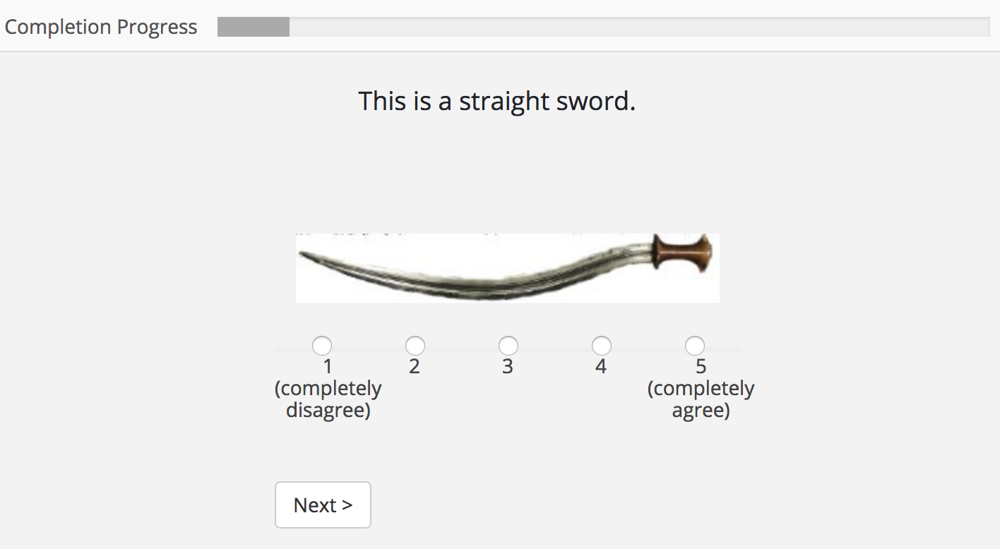

# Week 1 Homework

## 1.1 Develop an image-rating experiment

In this experiment, subjects will be shown images one-at-a-time. Images will have an associated adjective, e.g. "tall", "bent", "striped", and subjects will be asked to rate to what extent each image has its associated trait on a 1–5 scale.

Here is what a trial looks like in my solution:

### Getting started

All necessary files have been provided to you in the following GitHub repository: [https://github.com/Narquelion/lpl-training](https://github.com/Narquelion/lpl-training)

To implement this experiment, you will need to do two things:

1. Create a list of stimuli in  `hw1/resources/data/hw1.data.json`
2. Write the `initTrials()` function on line 75 of `hw1/resources/js/hw1/experiment.js`

As a rough guide, my `stimuli` object required 43 lines, and my `initTrials()` function required 30 lines.

### Image-adjective pairings

Images will need to be rated on these adjectives:

1. "Glass" (beer1-5.jpg): "full", "empty"
2. "Hallway" (hallway1-3.jpg): "wide", "narrow"
3. "Boat" (powerboat.jpg): "big", "small"
4. "Screwdriver" (screwdriver1-5.jpg): "long", "short"
5. "Sword" (sword1-2,4-5.jpg): "curved", "straight"
6. "Table" (table1-5.jpg): "tall", "short"
7. "Tree" (tree1,5.jpg): "tall", "short"
8. "Tub" (tub1-5.jpg): "full", "empty"

Note that the name that should be displayed in the experiment does not always match the image name. Your solution should address this (*without* changing the filenames).

### Hints

* Keep the functionality of `jsPsych.randomization.factorial()` in mind when creating your list of stimuli. In other words, don't just make a list of all possible trials! Documentation for this function can be found here here: [https://www.jspsych.org/core_library/jspsych-randomization/](https://www.jspsych.org/core_library/jspsych-randomization/).
* In this vein, my solution for `initTrials()` involved two loops. Loop 1 generates the factors for each object, i.e. generates all possible combinations of object + adjective + scale position. Loop 2 generates the actual rating trials.
* `jsPsych.randomization.shuffle()` will randomize your trials.

### Testing

Your browser will probably complain if you try to run this experiment without actually serving it from somewhere. This is because most browsers block the loading of certain resources from your filesystem (in this case the JSON file). You can do one of two things:

##### Option 1

 Convert the JSON file into a JavaScript file for offline testing. In this case, you will need to inlude it in `hw1.experiment.html`. You will also need to remove the JSON-loading code in `hw1.main.js` and instead load using the object in your JS file:

    function attemptLoad(file) {
      // Comment out JSON loading
      // $.getJSON(file, loadExperimentFromJSON).fail(error);
      loadExperimentFromJSON(/* NAME OF YOUR DATA OBJECT HERE */);
    }
 
##### Option 2

If you want to try it out as-is, you can install a command line tool that lets you serve content locally. I did this with Jekyll since I had it on hand already. Note that later we will go over serving via the Firebase CLI, so if you don't want to install anything at this time, don't worry about it.

To install Jekyll and start a server on Mac OS (my preferred way):
  
1. Update Xcode if necessary: `xcode-select --install`
2. Download and install Homebrew, if you don't have it
3. `brew install ruby`
4. `gem install jekyll`
5. `cd $project-directory`
6. `jekyll serve	`

If you're on Linux or Windows, use the appropriate tools to install Ruby, and then install Jekyll as above.

### Debugging

All browers come equipped with a browser console. Any explicit errors (missing braces, etc.) or warnings (e.g. script failed to load) will show up here. For more difficult to detect errors, you can be lazy and use `console.log()` within your code to check values, or you can use the brower's debugger to set breakpoints.

## 1.2 Generating pseudo-balanced trials with Python

A Latin square is an *n* x *n* matrix of symbols arranged such that a given symbol occurs only once in each row and column. For example,

|  |  |  |
|:-:|:-:|:-:|
| a | b | c |
| c | a | b |
| b | c | a |

is a Latin square.

A reduced Latin square is a Latin square where the first column and first row are in their natural order (e.g. numerical or alphabetical order). For example,

|  |  |  |
|:-:|:-:|:-:|
| a | b | c |
| b | c | a |
| c | a | b |

is a reduced Latin square.

Latin squares are commonly used in experimental design to ensure that each item is seen in a different position for each subject. A balanced Latin square, in particular, optimizes the balance of items so that every item appears the same number of times after each other item.

In the lab, we frequently use reduced Latin squares when we need to balance a set of conditions over a set of items. In other words, say we have items [a, b, c, d] and conditions [1, 2]. We want to collect an even number of each condition for each item.  We can do this by first creating a reduced Latin square representing our items:

|  |  |  | |
|:-:|:-:|:-:|:-:|
| a | b | c | d |
| b | c | d | a |
| c | d | a | b |
| d | a | b | c |

Then, we combine the items with our conditions like so:

|  |  |  | |
|:-:|:-:|:-:|:-:|
| a1 | b2 | c1 | d2 |
| b1 | c2 | d1 | a2 |
| c1 | d2 | a1 | b2 |
| d1 | a2 | b1 | c2 |

As you can see, this results in each item being paired twice with each condition. After this, we would randomize each row of trials, or if we wanted to be extra cautious, map our combinations onto a balanced Latin square.

### 1.2a

Write a Python script that will generate a reduced Latin square of order 32. (In other words, *n* = 32.) Each cell will contain a number in the range 1—32.

**Hint:** This can be done using two list comprehensions.

### 1.2b

Map the set of conditions `[a, b, c, d, e, f, g, h]` onto your Latin square. The output will be a 32 x 32 matrix of strings of the format "1_a", "2_b", etc. I.e., the item number, an underscore, and then the condition.

**Hint:** Use the `zip()` function. This can be done with a single list comprehension. :)

**Hint 2:** In Python, you can make reps of a list using `*`. E.g. `[1, 2, 3] * 2` returns `[1, 2, 3, 1, 2, 3]`.

### 1.2c

Print the following, in comma-separated format, to a CSV file:

* A set of headers. Headers should be of the format Trial1, Trial2, etc.
* Each row of trials, randomized.

Output will look like this:

    Trial1,Trial2,Trial3,Trial4...
    1_a,3_b,4_b,2_a...
    3_a,2_b,1_a,4_b...
    ...

**Hint:** Use `str.join()`

**Hint 2:** The header can be generated with a list comprehension. The trials require a loop. Use `random.shuffle()` to randomize them.

**Hint 3:** You can output to a file using the `>` operator:

    python latin_square.py > trials.csv

### 1.2 bonus

Write a script that will generate an unreduced, balanced Latin square of order 32.